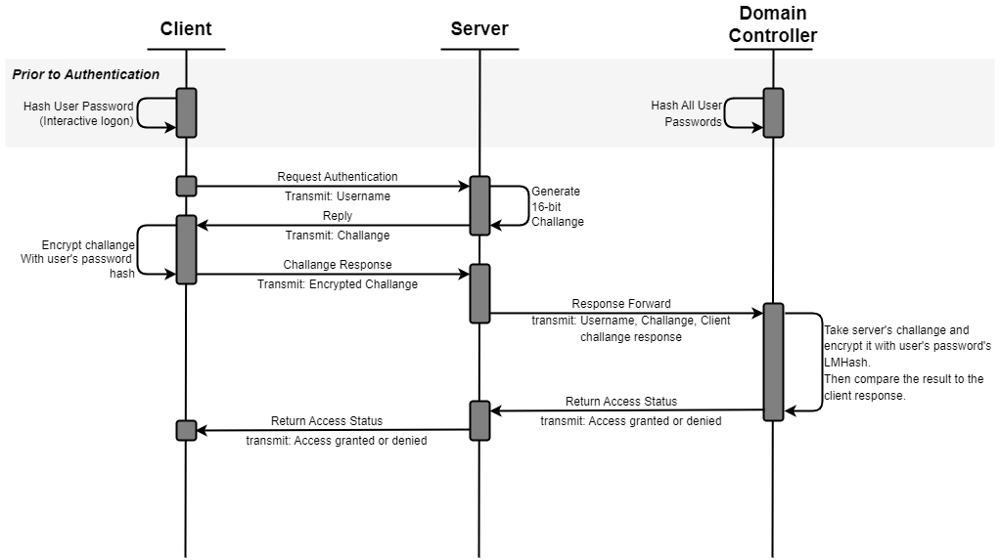
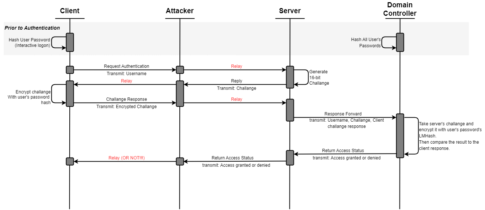

# NTLM \ NEW TECHONOLOGIES LAN MANAGER

Windows **New Techologies Lan Manager**, is a suite of security protocols used to authenticate a user's identity. At it's core NTLM is an SSO (Single-sign on) authentication protocol that doen't send the password on the wire. There are two versions to the protocol, V1 and V2 where V2 is the "more secure" one.

### How Does It Work?

NTLMv1 process.

There is little to no difference in the process between V1 and V2 so Ill explain it and elaborate on the slight difference later.

The process is as goes:

> When a **client** wants to authenticate themselves to a server, it will send an **authentication request**.

> Then The **server** will generate a random *nonce*, a 16 bit random number which is called a **challange**. And will send it back to the server.

> The **Client** will *encrypt* that challange with the **LM hash** of the user's password. an LM Hash is a 32 hexadecimal digit digest of the password (as seen below).

An example of an NTLM Hash.

> After recieving the Client's answer the **Server** will check the answer by decrypting the challange with the hash of the password that it has. The password may be stored inside the server's SAM storage or it will forward that encrypted channage to the Domain Controller for decrypting.
>
> In the first case, the server will validate the user incase it was able to decrypt the password. otherwise not.
>
> In the second case, the DC will validate the user.

So the difference between V1 and V2 and why V2 is "more secure" is just that V2 uses variable length hashes, and the client has to return a timestamp as well as their username in the 3rd step.

### Why Is It So God Damn WEAK!

There are multiple reasons for that, and we will go over them one by one.

> **Weak Cryptography**
>
> The hashes and cryptographic practices used in the NTLM Protocol are outdated and weak. It is easy enough to be able to crack a cleartext 8 character password in less then a day with standard hardware.
>
> 1. The hashing algorithm is based on MD4, which is weak.
> 2. The hash is saved as is with no salt in the machine's memory, making it susceptible to memory attacks (pth).

> **Relay Attacks**
>
> The "3 way handshake" that the protocol operates by is suceptible to MitM relay attacks. An attack where an attacker places themselves in a position inbetween the client and the server and simply relays the messages back and forth. In that position, the client believes the attacker is the server and the server believes the attacker is an innocent client. The attacker is then authenticated to the server instead of the client and has acces to all the rsources the client would have.

NTLM Relay Attack.

> **No Mutual Authentication**
>
> This flaw is based on the fact that the client doesn't authenticate the server's identity. Meaning an attacker can identify as a server in a MitM attack and gain the credentials of the client. This is like the relay attack instead however the attacker can spread latteraly to the entire network using the client's credentials.
